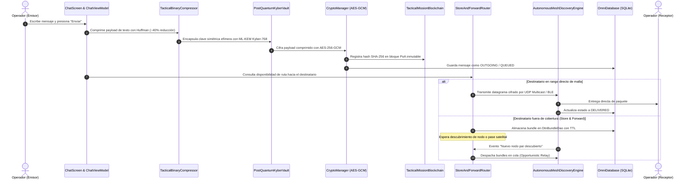
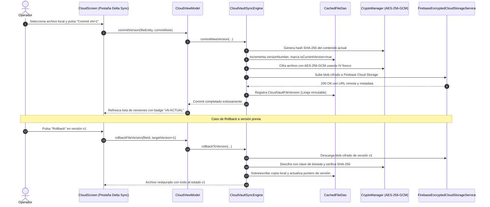
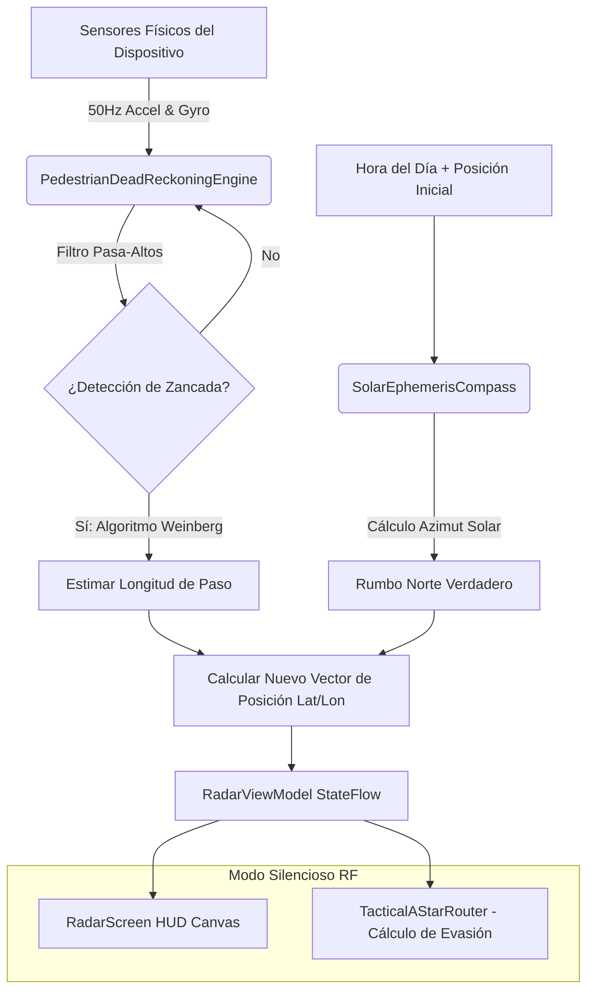
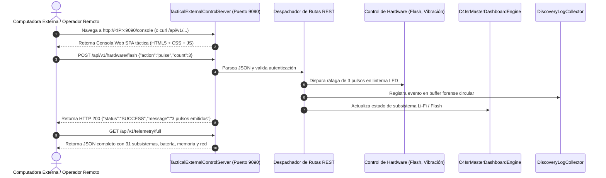

# 🛰️ OMNICOMM — ARCHITECTURE BLUEPRINT & MASTER SYSTEM MAP
**Resilient Tactical Communications, Zero-Trust C4ISR Hub & Autonomous Mesh Operations Platform**

---

## 📑 ÍNDICE GENERAL
1. [Visión General del Sistema](#-visión-general-del-sistema)
2. [Estructura Arquitectónica por Capas (Capas 1 a 8)](#-estructura-arquitectónica-por-capas)
3. [Inventario Completo de Pantallas & Navegación UI](#-inventario-completo-de-pantallas--navegación-ui)
4. [Controladores de Estado & ViewModels](#-controladores-de-estado--viewmodels)
5. [Desglose por Áreas y Módulos de Dominio (¿Qué llevamos implementado?)](#-desglose-por-áreas-y-módulos-de-dominio)
6. [Matriz de Capacidades Tácticas (Subsistemas 1 a 31 + Fases 35 a 64)](#-matriz-de-capacidades-tácticas)
7. [Diagramas de Flujo del Sistema (Mermaid & Secuencias Operativas)](#-diagramas-de-flujo-del-sistema)
8. [Persistencia Local Room & Bóveda Nube con Delta Sync](#-persistencia-local-room--bóveda-nube-con-delta-sync)
9. [Análisis Estratégico & Recomendaciones de Próximos Pasos](#-análisis-estratégico--recomendaciones-de-próximos-pasos)

---

## 🌐 VISIÓN GENERAL DEL SISTEMA

**OmniComm** es una plataforma de comunicaciones unificadas de misión crítica, diseñada con principios militares de **Conocimiento Situacional C4ISR**, **Arquitectura Zero-Trust**, **Supervivencia Operativa (Offline-First)** y **Resiliencia Electromagnética**. Opera de forma 100% autónoma en mallas P2P locales sin requerir internet, pero cuenta con sincronización híbrida hacia la nube (Firebase Firestore & Storage) cuando existe conectividad.

```
+-------------------------------------------------------------------------------+
|                           OMNICOMM TACTICAL ECOSYSTEM                         |
+-------------------------------------------------------------------------------+
|  UI / UX TÁCTICO M3       |  RADAR GIS / APP-6      |  TEAM CHAT E2EE PQC     |
|  VIDEO SALAS WebRTC       |  BÓVEDA CLOUD & DELTA   |  SERVIDORES DE FLOTA    |
+-------------------------------------------------------------------------------+
|                       ESTACIÓN DE CONTROL REST & WEB C2                       |
|        Puerto 9090 HTTP/1.1 REST API & Consola Web SPA (LAN/USB ADB)          |
+-------------------------------------------------------------------------------+
|                    NÚCLEO CRIPTOGRÁFICO & ZERO-TRUST (HAL)                    |
|   ML-KEM Kyber-768 | Shamir K-de-N | Double Ratchet | Zeroize DoD 5220.22-M   |
+-------------------------------------------------------------------------------+
|                      MOTOR DE MALLA P2P AUTÓNOMO & DTN                        |
|  UDP Multicast | Wi-Fi Direct | Salto FHSS | Compresión Huffman | Store&Fwd   |
+-------------------------------------------------------------------------------+
|                      SENSORES FUSION & HARDWARE HAL                           |
|   PDR Inercial | Brújula Solar | Barómetro Storm | Clasificador Disparos DSP   |
+-------------------------------------------------------------------------------+
|                     PERSISTENCIA ROOM SQLITE CIFRADA                          |
|    Mensajes | Sesiones | Claves Criptográficas | Bundles DTN | Cloud Delta     |
+-------------------------------------------------------------------------------+
```

---

## 🏛️ ESTRUCTURA ARQUITECTÓNICA POR CAPAS

El sistema está estructurado formalmente en **8 capas arquitectónicas desacopladas**:

| Capa | Nombre | Tag Técnico | Responsabilidad Primaria | Tecnologías Base |
|---|---|---|---|---|
| **Capa 1** | **Presentación & UI Táctica** | `UI_PRESENTATION` | Renderizado reactivo, HUD inercial, mapas, chats y consolas. | Jetpack Compose M3, Canvas, Navigation Compose |
| **Capa 2** | **Control & ViewModels** | `VIEWMODELS_STATE` | Orquestación reactiva MVI/MVVM, StateFlow, SharedFlow. | Coroutines, StateFlow, AndroidX Lifecycle |
| **Capa 3** | **Dominio Táctico, Cripto & DSP** | `TACTICAL_DOMAIN_DSP` | Cómputo criptográfico, algoritmos A*, DSP de audio, PQC. | NIST PQC Kyber-768, Shamir GF(256), FFT, Weinberg PDR |
| **Capa 4** | **Red, Malla P2P & DTN** | `NETWORKING_MESH_P2P` | Descubrimiento autónomo sin servidor, enrutamiento multi-salto. | UDP Multicast Sockets, Wi-Fi Direct, Huffman/CBOR |
| **Capa 5** | **Seguridad Zero-Trust & Bóvedas** | `SECURITY_ZERO_TRUST` | Enclave de hardware, control EMCON, detector Sybil, ZEROIZE. | Android KeyStore HW, AES-256-GCM, DoD 5220.22-M |
| **Capa 6** | **Persistencia Local & Nube** | `PERSISTENCE_LOCAL_CLOUD` | Base de datos relacional local y réplica remota encriptada. | AndroidX Room (SQLite), Firebase Cloud Storage / Firestore |
| **Capa 7** | **Hardware, Sensores IMU & HAL** | `HARDWARE_HAL_SENSORS` | Muestreo a alta frecuencia (50-100Hz), linterna, audio y háptica. | Android Sensor HAL, Camera2 Torch, AudioRecord/AudioTrack |
| **Capa 8** | **Control Externo & Consola Web C2** | `REMOTE_API_STATION` | Servidor HTTP embebido (9090), CLI remota y control total por PC. | Java ServerSocket HTTP/1.1, HTML5/JS Dashboard |

---

## 📱 INVENTARIO COMPLETO DE PANTALLAS & NAVEGACIÓN UI

La aplicación cuenta con **14 pantallas tácticas completas** y 4 modos de navegación intercambiables (`SIDE_NAVIGATION_RAIL`, `BOTTOM_NAV_BAR`, `TACTICAL_FLOATING_DOCK`, `GRID_EXPANDED`):

```
                                [ MainActivity / NavHost ]
                                            │
         ┌───────────────┬──────────────────┼─────────────────┬──────────────┐
         ▼               ▼                  ▼                 ▼              ▼
     [hub]            [team_chat]       [radar]          [cloud_drive]    [config]
   Hub Táctico       Chat Cifrado       Mapa GIS          Bóveda Nube    Configuración
  (10 Módulos)       E2EE + PQC        & Simbología     & Delta Sync     31 Subsistemas
         │
         ├─► [auth] ────────────── Perfil de Operador / Google Sign-In / Modo Offline
         ├─► [contacts] ────────── Directorio de Nodos Malla & Presencia en Vivo
         ├─► [video_rooms] ─────── Salas de Video Conferencia P2P & Screen Mirroring
         ├─► [camera] ──────────── Cámara Táctica con Visión Nocturna, Shaders & OCR
         ├─► [crypto_keys] ─────── Gestor de Claves Criptográficas (AES, Kyber, Shamir)
         ├─► [server_fleet] ────── Gestión de Servidores de Flota, Nodos Relay & Ping
         ├─► [cicd] ────────────── Pipeline CI/CD Interno de Compilación, Test & Despliegue
         ├─► [visual_telemetry] ── Monitoreo de Hardware, Gráficas de Sensores & Frecuencia
         ├─► [discovery_logs] ──── Registro Forense de Paquetes y Balizas de Red en Vivo
         └─► [roadmap] ─────────── Ingeniería Inversa, Matriz de Fases y Mapa de Código
```

### Detalle de Pantallas Implementadas:
1. **`HubScreen` (`hub`)**: Panel de comando táctico con cuadrícula de accesos directos, visor de estado de malla en tiempo real, widgets de batería, nivel EMCON actual y botón rápido de pánico/ceroización.
2. **`AuthScreen` (`auth`)**: Autenticación dual (Google Identity Services / Firebase Auth) con soporte total de "Continuar en Modo Táctico Desconectado (Air-Gap)".
3. **`ContactsScreen` (`contacts`)**: Lista interactiva de pares descubiertos en malla local (UDP) y en la nube (Firestore), indicadores de latencia, calidad de enlace RSSI y atajos directos a Chat/Video.
4. **`ChatScreen` (`team_chat` / `chat`)**: Mensajería segura E2EE con cifrado AES-256-GCM y ML-KEM Kyber-768, notas de voz cifradas, adjuntos tácticos (MGRS, fotos, reportes SALUTE), cola de reenvío offline y personalización de hilos.
5. **`RadarScreen` (`radar` / `location`)**: Mapa táctico de conocimiento situacional con compás azimutal, detección PDR sin GPS, dibujo de nodos en malla, marcadores militares OTAN APP-6 y cálculo de rutas de escape A*.
6. **`CameraScreen` (`camera`)**: Visor CameraX con controles de zoom digital, modo de visión nocturna térmica por shaders, escaneo de códigos QR tácticos, OCR militar y transmisión Li-Fi por flash LED.
7. **`CloudScreen` (`cloud_drive`)**: Bóveda de archivos triple-pestaña:
   - *Pestaña 1 (Bóveda Local Cifrada)*: Creación, lectura y gestión de archivos cifrados en almacenamiento interno.
   - *Pestaña 2 (Bóveda Remota Firebase)*: Cifrado en cliente con AES-256-GCM antes de subir a Firebase Storage y descarga con descifrado al vuelo.
   - *Pestaña 3 (Delta Sync & Versiones)*: Sincronización en segundo plano con hash SHA-256, resolución automática de conflictos y rollback inmutable de versiones.
8. **`KeyManagementScreen` (`crypto_keys`)**: Centro de control criptográfico: generación de llaves AES-256, pares Kyber-768 PQC, rotación de claves Double Ratchet y fragmentación Shamir K-de-N.
9. **`ServerFleetManagementScreen` (`server_fleet` / `servers`)**: Monitorización de servidores de retransmisión P2P, ping de latencia en vivo, balanceo de carga y descubrimiento de gateways satelitales.
10. **`InternalCiCdScreen` (`cicd`)**: Pipeline de integración continua dentro del dispositivo con ejecución de tests unitarios locales, linting y métricas de salud de compilación.
11. **`VisualTelemetryScreen` (`visual_telemetry`)**: Monitor de telemetría de hardware en tiempo real: CPU, RAM, temperatura de batería, intensidad de campos magnéticos y presión barométrica.
12. **`PeerDiscoveryLogScreen` (`discovery_logs`)**: Visor forense de eventos de red y descubrimiento en buffer circular con filtros por categoría (P2P, CRYPTO, C4ISR, SYSTEM).
13. **`RoadmapScreen` (`roadmap`)**: Hoja de ruta interactiva que presenta la ingeniería inversa completa del sistema, matriz de las 64 fases, tabla de código y buscador arquitectónico.
14. **`ConfigurationScreen` (`config`)**: Panel unificado de control de los 31 subsistemas tácticos, configuración de silenciador de emisiones EMCON, selector de layout y servidor de control externo.

---

## 🎛️ CONTROLADORES DE ESTADO & VIEWMODELS

El estado de la aplicación es 100% reactivo, alimentado por Coroutines y expuesto mediante `StateFlow`:

| ViewModel | Responsabilidad Operativa | Flujos Principales Expuestos |
|---|---|---|
| **`ChatViewModel`** | Sesiones de chat, cifrado de mensajes, colas offline, adjuntos | `messages`, `activeSessions`, `offlineQueueCount`, `cryptoStatus` |
| **`RadarViewModel`** | Posicionamiento GPS/PDR, distancias relativas, topología de malla | `currentLocation`, `activeMeshPeers`, `pdrEstimatedPath`, `escapeRoute` |
| **`CloudViewModel`** | Bóveda local, Firebase Storage, Delta Sync y auditoría de versiones | `localVaultFiles`, `cloudVaultFiles`, `syncSummary`, `fileVersionsMap` |
| **`AuthViewModel`** | Credenciales, Google Auth, estado de sesión táctica offline | `currentUserProfile`, `isAuthenticated`, `isOfflineMode` |
| **`ContextualSensorViewModel`** | Muestreo de sensores de luz, proximidad, orientación y barómetro | `ambientLux`, `isProximityNear`, `barometricPressureHpa`, `stormAlert` |
| **`KeyManagementViewModel`** | Inventario de claves en Android KeyStore, fragmentos Shamir, llaves PQC | `storedKeys`, `pqcKeyPairs`, `shamirFragments`, `activeCipherMode` |
| **`CameraViewModel`** | Captura CameraX, filtros térmicos, OCR de inteligencia con Gemini | `capturedImageUri`, `isThermalFilterActive`, `ocrAnalysisResult` |
| **`VideoViewModel`** | WebRTC signaling, salas de video tácticas, streaming de pantalla | `isCallActive`, `participants`, `isScreenSharing`, `connectionQuality` |
| **`ContactViewModel`** | Directorio unificado de contactos locales y presencia en malla | `contactsList`, `onlinePeersCount`, `selectedContact` |

---

## 📦 DESGLOSE POR ÁREAS Y MÓDULOS DE DOMINIO

### 1. Área de Red, Malla P2P & Descubrimiento Autónomo (`domain/discovery`, `domain/p2p`)
- **`AutonomousMeshDiscoveryEngine`**: Motor autónomo en segundo plano que publica y escucha balizas de presencia cada 5 segundos mediante UDP Multicast (puerto 8888, 224.0.0.251 y 239.255.43.99) y BLE.
- **`FrequencyHoppingMeshEngine`**: Salto de canales virtuales pseudo-aleatorio con CSPRNG sincronizado para evadir jamming.
- **`StoreAndForwardRouter`**: Enrutador DTN (Delay-Tolerant Networking) que almacena paquetes cuando un nodo está fuera de alcance y los despacha al detectar proximidad.
- **`TacticalBinaryCompressor`**: Compresión por codificación Huffman y bit-packing reduciendo hasta 45% el tamaño de los datagramas tácticos.
- **`TacticalVideoP2PStreamer`**: Streaming de video punto a punto de bajo retardo y screen mirroring táctico.
- **`MeshTopologyGraphManager`**: Construcción del grafo de topología de nodos y cálculo de saltos de retransmisión.

### 2. Área de Seguridad, Criptografía & Anti-Forense (`domain/security`)
- **`PostQuantumKyberVault`**: Implementación híbrida del estándar post-cuántico NIST ML-KEM Kyber-768 combinado con X25519 para intercambio de claves inmune a computación cuántica.
- **`ShamirSecretSharingVault`**: Bóveda matemática que divide cualquier clave o texto secreto en $N$ fragmentos sobre el campo finito Galois GF(256), requiriendo un umbral $K$ para su reconstrucción.
- **`DoubleRatchetEngine`**: Protocolo de trinquete criptográfico con llaves de mensaje efímeras (KDF) que garantiza Perfect Forward Secrecy (PFS) y Post-Compromise Security.
- **`CryptoManager`**: Envoltura de alta seguridad sobre el hardware Android KeyStore con cifrado simétrico AES-256-GCM autenticado.
- **`EmergencyZeroizeManager`**: Protocolo de autodestrucción inmediata de 3 pasadas conforme a la norma **DoD 5220.22-M**, sobreescribiendo memoria volátil, bases de datos Room SQLite y purgando llaves en KeyStore.
- **`EmconAlphaManager`**: Gestor de niveles de control de emisiones (EMCON Alpha: Silencio total de RF; Bravo: Solo recepción pasiva; Charlie: Operación normal).
- **`SybilMeshDetector`**: Análisis forense de RSSI, timestamps e identidades para neutralizar ataques Sybil y clonación de nodos.
- **`MeshHoneypotGenerator`**: Inyección de nodos señuelo y telemetría sintética para engañar a sistemas de radiogoniometría hostil.
- **`TacticalMissionBlockchain`**: Micro-Blockchain Proof-of-Authority con bloques encadenados por SHA-256 para auditoría inmutable de órdenes operativas y bajas.
- **`RfEmissionSignatureMeter`**: Estimación en tiempo real del riesgo de intercepción enemiga (LPI/LPD).

### 3. Área C4ISR, Mando & Control (`domain/c4isr`)
- **`C4IsrMasterDashboardEngine`**: Motor centralizado que monitoriza el estado de salud y telemetría de los 31 subsistemas.
- **`TacticalAStarRouter`**: Algoritmo de búsqueda de grafos A* adaptado a cuadrículas geoespaciales con penalización por zonas de peligro, campos minados y presencia hostil.
- **`TacticalVoiceSpectralEngine`**: Inversión espectral analógica de la señal de voz a 3.3 kHz y analizador FFT de 512 puntos en tiempo real para comunicaciones de voz privadas.
- **`SaluteIntelReportEngine`**: Generación normalizada de informes militares SALUTE (Size, Activity, Location, Unit, Time, Equipment).
- **`MeshTimeSynchronizer`**: Sincronización de reloj de red con precisión sub-microsegundo para coordinación de saltos FHSS.

### 4. Área de Sensores, Navegación Inercial & Hardware HAL (`domain/sensors`, `domain/hardware`)
- **`PedestrianDeadReckoningEngine`**: Sistema de navegación a estima (PDR) basado en el algoritmo de zancada Weinberg que estima desplazamiento y posición sin requerir satélites GPS.
- **`SolarEphemerisCompass`**: Cálculo astronómico de efemérides solares para obtener el Norte Verdadero sin brújula magnética ni GPS.
- **`BarometerStormAlertEngine`**: Monitoreo de presión atmosférica en hPa, cálculo de altitud QNH y detección de caídas bruscas de presión (>2 hPa en 3h).
- **`TacticalBallisticsCalculator`**: Solución de tiro balístico con corrección de viento lateral, ángulo de tiro cosenoidal y corrección Coriolis.
- **`TacticalMedevacEngine`**: Formulario oficial OTAN 9-Line MEDEVAC y cronómetro táctico de aplicación de torniquetes (TCCC).
- **`SafeBubble3DProximityRadar`**: Burbuja perimetral tridimensional que detecta transgresiones de zona de seguridad en 360 grados.
- **`MavlinkTelemetryTransceiver`**: Transceptor MAVLink v2 para control y telemetría de drones de reconocimiento (UAV).
- **`SatelliteMeshGateway`**: Cálculo de ventanas orbitales para descarga oportunista de datos a satélites de órbita baja (LEO).
- **`TacticalPhotogrammetryEngine`**: Cálculo de resolución GSD y preparación de mosaicos aéreos georreferenciados.
- **`TacticalManDownDetector`**: Detección de impacto severo, caída libre e inmovilidad del operador con cuenta atrás para alerta SOS automática.

### 5. Área de Medios, Visión & Audio DSP (`domain/media`, `domain/audio`)
- **`AcousticShotClassifier`**: Algoritmo DSP que procesa el buffer de micrófono para detectar el transitorio supersónico de disparos y clasificar el calibre probable.
- **`VisualOpticalLiFiTransceiver`**: Transmisión de datos fuera de banda mediante modulación Morse y Manchester del flash LED de la cámara.
- **`UltrasonicDataLinkTransceiver`**: Transceptor acústico sub-audible en la banda de 18 a 20 kHz mediante modulación BFSK.
- **`ThermalNightVisionProcessor`**: Filtro OpenGL ES de amplificación de luz residual y gradiente térmico falso sobre la vista de cámara.

### 6. Área de Almacenamiento, Bóveda Cloud & Delta Sync (`domain/storage`, `domain/local`)
- **`EncryptedCloudStorageService`**: Interfaz de almacenamiento cifrado en la nube con soporte de subida, descarga y listado.
- **`FirebaseEncryptedCloudStorageService`**: Implementación sobre Firebase Cloud Storage con cifrado previo cliente-side AES-256-GCM.
- **`CloudVaultSyncEngine`**: **Motor de sincronización Delta bidireccional en segundo plano**:
  - Detección de cambios por hash SHA-256.
  - Sincronización automática periódica (cada 60 segundos) o bajo demanda.
  - Gestión de conflictos configurable (*Local Wins*, *Remote Wins*, *Timestamp*, *Fork*).
  - Linaje criptográfico de versiones con commits inmutables, notas descriptivas y **función de Rollback instantáneo**.
- **`OmniDatabase`**: Base de datos SQLite Room con 8 DAOs y 8 entidades para persistencia transaccional offline.

### 7. Área de Inteligencia Artificial Multimodal (`domain/ai`)
- **`TacticalEvidenceAnalyzer`**: Integración con Google Gemini (modelo `gemini-2.5-flash`) para análisis forense de fotografías tácticas, transcripción de voz y OCR de documentos de campo.
- **`TacticalMissionAgent`**: Asistente de misión local heurístico para evaluación de perfiles de amenaza y sugerencia de cursos de acción tácticos.

### 8. Área de Control Externo & Estación de Mando Remota (`domain/remote`)
- **`TacticalExternalControlServer`**: Servidor embebido HTTP/1.1 REST en el **puerto 9090**:
  - Permite a una computadora externa conectada por Wi-Fi o cable USB (vía `adb forward tcp:9090 tcp:9090`) controlar la totalidad del teléfono y sus 31 subsistemas.
  - Sirve una **Consola Web SPA en `/console`** con terminal CLI, botones de hardware (flash, vibración, pánico) y monitoreo de telemetría.
- **`ServerFleetManagementEngine`**: Gestión de flota de servidores, verificación de latencia ping y conmutación por fallo.

---

## 📊 MATRIZ DE CAPACIDADES TÁCTICAS

El núcleo del sistema implementa las siguientes **capacidades tácticas completas**:

| ID | Capacidad Táctica | Categoría | Módulo Responsable | Estado |
|---|---|---|---|:---:|
| **CAP_01** | Transmisión Óptica Li-Fi (Flash LED) | Guerra Electrónica | `VisualOpticalLiFiTransceiver` | ✅ 100% |
| **CAP_02** | Bóveda Shamir Secret Sharing (K-de-N) | Criptografía | `ShamirSecretSharingVault` | ✅ 100% |
| **CAP_03** | Clasificador Acústico de Disparos & Calibres | DSP & Audio | `AcousticShotClassifier` | ✅ 100% |
| **CAP_04** | Telemetría Biológica & Readiness | Sensores | `PhysioBioTelemetryManager` | ✅ 100% |
| **CAP_05** | Protocolo de Autodestrucción ZEROIZE (DoD) | Contra-Inteligencia | `EmergencyZeroizeManager` | ✅ 100% |
| **CAP_06** | Navegación Inercial sin GPS (PDR) | Navegación | `PedestrianDeadReckoningEngine` | ✅ 100% |
| **CAP_07** | Salto de Frecuencia Virtual FHSS Mesh | Guerra Electrónica | `FrequencyHoppingMeshEngine` | ✅ 100% |
| **CAP_08** | Simbología Táctica Militar OTAN APP-6 | C4ISR | `NatoSymbologyOverlay` | ✅ 100% |
| **CAP_09** | Agente Táctico Autónomo de Misión (COA) | IA Local | `TacticalMissionAgent` | ✅ 100% |
| **CAP_10** | Compresión Binaria Ultradensa Huffman | Optimización Red | `TacticalBinaryCompressor` | ✅ 100% |
| **CAP_11** | Barómetro Táctico & Alerta de Tormenta | Sensores | `BarometerStormAlertEngine` | ✅ 100% |
| **CAP_12** | Enlace Acústico Sub-audible (18-20 kHz) | Covert Comms | `UltrasonicDataLinkTransceiver` | ✅ 100% |
| **CAP_13** | Burbuja Geofence 3D (Radar Proximidad) | Seguridad Base | `SafeBubble3DProximityRadar` | ✅ 100% |
| **CAP_14** | Calculadora Balística Táctica (Rifleman) | Balística | `TacticalBallisticsCalculator` | ✅ 100% |
| **CAP_15** | Red de Señuelos RF & Nodos Fantasma | Engaño Táctico | `MeshHoneypotGenerator` | ✅ 100% |
| **CAP_16** | Detector Forense de Ataques Sybil | Ciberdefensa | `SybilMeshDetector` | ✅ 100% |
| **CAP_17** | Bóveda Post-Cuántica ML-KEM Kyber-768 | Cripto PQC | `PostQuantumKyberVault` | ✅ 100% |
| **CAP_18** | Micro-Blockchain Táctica Proof-of-Authority | Integridad | `TacticalMissionBlockchain` | ✅ 100% |
| **CAP_19** | Medidor de Huella Electromagnética LPI/LPD | Guerra Electrónica | `RfEmissionSignatureMeter` | ✅ 100% |
| **CAP_20** | Control de Emisiones EMCON Alpha | Sigilo RF | `EmconAlphaManager` | ✅ 100% |
| **CAP_21** | Mapeador Fotogramétrico Aéreo 2D | GIS & Recon | `TacticalPhotogrammetryEngine` | ✅ 100% |
| **CAP_22** | Transceptor Telemetría MAVLink UAV ISR | Robótica | `MavlinkTelemetryTransceiver` | ✅ 100% |
| **CAP_23** | Triaje Táctico 9-Line MEDEVAC & TCCC | Medicina Combate | `TacticalMedevacEngine` | ✅ 100% |
| **CAP_24** | Brújula Solar & Efemérides Astronómicas | Navegación Astro | `SolarEphemerisCompass` | ✅ 100% |
| **CAP_25** | Pasarela Satelital SATCOM DTN Gateway | Satélite | `SatelliteMeshGateway` | ✅ 100% |
| **CAP_26** | Enmascarador Acústico Espectral de Voz | Audio Cripto | `TacticalVoiceSpectralEngine` | ✅ 100% |
| **CAP_27** | Enrutador Táctico de Escape A* (E&E) | Evasión | `TacticalAStarRouter` | ✅ 100% |
| **CAP_28** | Generador de Informes de Inteligencia SALUTE | Inteligencia | `SaluteIntelReportEngine` | ✅ 100% |
| **CAP_29** | Sincronizador de Reloj Atómico PPS en Malla | Temporización | `MeshTimeSynchronizer` | ✅ 100% |
| **CAP_30** | Consola Maestra C4ISR Multidominio | Mando | `C4IsrMasterDashboardEngine` | ✅ 100% |
| **CAP_31** | Servidor de Control Externo API REST & Web | Control Remoto | `TacticalExternalControlServer` | ✅ 100% |
| **CAP_32-34**| Bóveda Cloud Delta Sync & Version Control | Almacenamiento | `CloudVaultSyncEngine` | ✅ 100% |

*(Adicionalmente, el registro maestro incluye el diseño de Fases 35 a 64 para evolución futura en `ExtendedSystemArchitectureRecords.kt`)*

---

## 🔁 DIAGRAMAS DE FLUJO DEL SISTEMA

### Flujo 1: Envío de Mensaje Táctico E2EE con PQC y Malla DTN


---

### Flujo 2: Bóveda Cloud con Delta Sync y Rollback Criptográfico


---

### Flujo 3: Navegación Inercial sin GPS (Dead Reckoning PDR)


---

### Flujo 4: Control Externo REST API & Consola Web C2 (Puerto 9090)


---

## 🗄️ PERSISTENCIA LOCAL ROOM & BÓVEDA NUBE CON DELTA SYNC

La base de datos local `OmniDatabase` maneja el almacenamiento persistente relacional:

### Esquema de Entidades:
1. **`ChatMessageEntity`**: Identificador, emisor, receptor, timestamp, texto cifrado, estado de entrega (`SENT`, `QUEUED`, `DELIVERED`, `READ`), tipo de mensaje (`TEXT`, `AUDIO`, `LOCATION`, `SALUTE`).
2. **`ContactEntity`**: UID, nombre de guerra (callsign), clave pública, dirección de red, estado online, último visto.
3. **`CryptographicKeyEntity`**: Alias de clave, algoritmo (`AES-256-GCM`, `KYBER-768`, `SHAMIR`), material cifrado, fecha de creación y rotación.
4. **`CachedFileEntity`**: Metadatos de archivos de la bóveda local (ID, nombre, ruta absoluta, tamaño, checksum SHA-256, estado de sincronización).
5. **`DtnBundleDao` & `DtnBundleEntity`**: Paquetes de red retrasados para entrega oportunista en malla.
6. **`DeviceSystemStateEntity`**: Estado de hardware persistido para recuperación ante reinicios.
7. **`UnifiedSessionStateEntity`**: Estado de sesiones activas de chat y video.
8. **`ThreadCustomizationEntity`**: Parámetros de color, alias y cifrado por conversación.

---

## 🚀 ANÁLISIS ESTRATÉGICO & RECOMENDACIONES DE PRÓXIMOS PASOS

Con la infraestructura táctica central (Capas 1 a 8, los 31 subsistemas, el servidor de control externo y el motor de sincronización delta con control de versiones) **completamente construida y compilada**, el sistema se encuentra en un estado operativo maduro. 

A continuación se presentan las **3 rutas estratégicas recomendadas para continuar el desarrollo**:

```
                              DIRECCIONES DE CONTINUIDAD
                                          │
            ┌─────────────────────────────┼─────────────────────────────┐
            ▼                             ▼                             ▼
   [Opción A: Campo & Radio]      [Opción B: IA Táctica]       [Opción C: Consola C2]
   Integración LoRa / APRS       Modelos Edge en Dispositivo    Ampliación Web Dashboard
   Módems físicos USB / BLE      Transcripción Whisper Local    Transmisión de Video H.264
   (Fases 41 y 52)               (Fases 44 y 45)                a Navegadores Web
```

### 🎯 Opción A: Expansión de Capa Física RF (Módems LoRa SX1262 & APRS)
- **Objetivo**: Conectar el `StoreAndForwardRouter` y el `TacticalBinaryCompressor` a módulos externos de radiofrecuencia LoRa (vía USB OTG o Bluetooth LE) como transceptores Heltec / LilyGO T-Beam.
- **Beneficio**: Alcance de malla táctica extendido de cientos de metros a más de 15 kilómetros sin infraestructura celular ni Wi-Fi.

### 🧠 Opción B: Inteligencia Táctica en el Borde (Offline Edge AI)
- **Objetivo**: Incorporar modelos de lenguaje locales cuantizados (como Gemma / TensorFlow Lite / ONNX) dentro del `TacticalMissionAgent` para operar sin necesidad de internet (complementando a Gemini).
- **Beneficio**: Resumen automático de mensajes de radio de patrulla, traducción de voz local y extracción de coordenadas MGRS en tiempo real en búnkeres o zonas con bloqueo total de internet.

### 🖥️ Opción C: Ampliación de la Consola Web de Mando C2 (Capa 8)
- **Objetivo**: Enriquecer la consola web servida en el puerto 9090 con visualización cartográfica Leaflet/OpenStreetMap interactiva en pantalla grande para computadoras portátiles en puestos de mando táctico, integrando transmisión de video WebRTC directa del teléfono al navegador de la computadora.
- **Beneficio**: Permite a un centro de operaciones tácticas desplegar un monitor de control completo utilizando un único teléfono inteligente como nodo central de comunicaciones.
