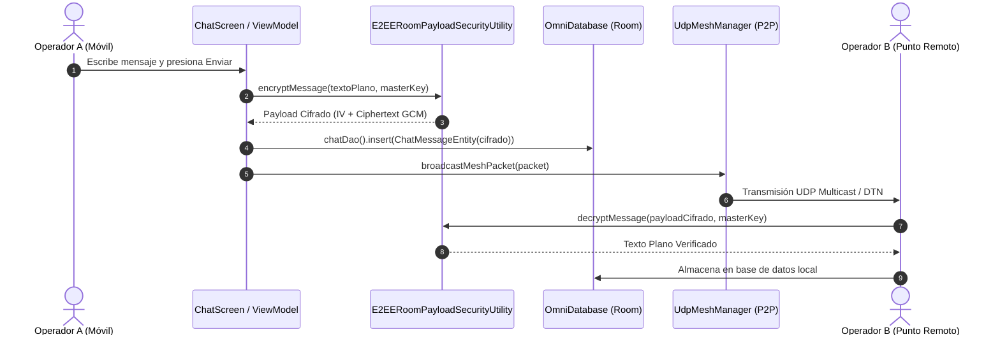
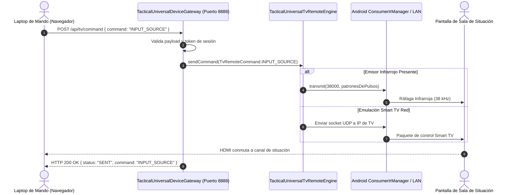

# 🏛️ Documento de Diseño de Software (SDD)

## OmniComm — Arquitectura de Sistema y Especificación de Diseño Técnico

**Versión del Documento**: 2.4.0  
**Estándar de Referencia**: IEEE 1016-2009 (Software Design Descriptions)  
**Clasificación**: Documento Técnico de Arquitectura e Ingeniería  

---

## 1. Introducción y Alcance del Sistema

Este documento describe formalmente la arquitectura de software, los componentes de bajo nivel, las estructuras de datos, los protocolos de comunicación y las interfaces de hardware que componen la plataforma **OmniComm**.

### 1.1 Objetivos de Diseño
1. **Desacoplamiento Estricto**: Separación modular entre las capas de presentación (Jetpack Compose), dominio táctico, capas de red y el Hardware Abstraction Layer (HAL).
2. **Resiliencia Operativa**: Tolerancia absoluta a fallos de hardware periférico, caídas de señal y desconexión total del entorno de red.
3. **Cero Dependencia de Servicios en la Nube**: El núcleo operativo funciona de manera autónoma con SQLite local y transporte punto a punto.
4. **Seguridad en Profundidad (Defense in Depth)**: Cifrado autenticado multicapa tanto en reposo (almacenamiento) como en tránsito (red y audio).

---

## 2. Descomposición Arquitectónica en 8 Capas

```
┌─────────────────────────────────────────────────────────────────────────────┐
│                           CAPA 1: PRESENTACIÓN (UI)                         │
│   Jetpack Compose M3 • Navigation Compose • Canvas Táctico • Dialogs C2     │
├─────────────────────────────────────────────────────────────────────────────┤
│                     CAPA 2: ORQUESTACIÓN Y ESTADO (MVI)                     │
│      ViewModels • StateFlow<UiState> • SharedFlow<Events> • Lifecycle       │
├─────────────────────────────────────────────────────────────────────────────┤
│                     CAPA 3: DOMINIO TÁCTICO, CRIPTO & DSP                   │
│   AES-256-GCM • ML-KEM Kyber-768 • Shamir GF(256) • Weinberg PDR • A* Map   │
├─────────────────────────────────────────────────────────────────────────────┤
│                         CAPA 4: TRANSPORTE Y MALLA P2P                      │
│     Sockets UDP Multicast (224.0.0.1) • Wi-Fi Direct • DTN Store & Forward  │
├─────────────────────────────────────────────────────────────────────────────┤
│                     CAPA 5: SEGURIDAD ZERO-TRUST Y EMCON                    │
│   Android KeyStore HW • Niveles EMCON 0-4 • Anti-Replay • Zeroize DoD 5220  │
├─────────────────────────────────────────────────────────────────────────────┤
│                  CAPA 6: PERSISTENCIA LOCAL Y BÓVEDA SEGURA                 │
│      Room Database (AndroidX) • E2EE Payload Security • Fallback Híbrido    │
├─────────────────────────────────────────────────────────────────────────────┤
│                   CAPA 7: HARDWARE ABSTRACTION LAYER (HAL)                  │
│   ConsumerIrManager • DisplayManager (HDMI) • AudioRecord/Track • USB Serial│
├─────────────────────────────────────────────────────────────────────────────┤
│                    CAPA 8: PASARELA Y ESTACIÓN EXTERNA C2                   │
│        Servidor Micro-HTTP Local (Puerto 8888) • Dashboard Web SPA          │
└─────────────────────────────────────────────────────────────────────────────┘
```

---

## 3. Especificación Detallada de Componentes Clave

### 3.1 Motor de Control Remoto Universal (`TacticalUniversalTvRemoteEngine`)
- **Ubicación**: `com.example.domain.hardware.TacticalUniversalTvRemoteEngine`
- **Responsabilidad**: Gestión de interfaces de control para televisores y monitores convencionales (vía infrarrojos) y Smart TVs (vía red local).
- **Mecanismos de Transmisión**:
  1. *IR Blaster Físico*: Interactúa con el servicio de sistema `ConsumerIrManager`. Si el hardware está presente (`hasIrEmitter()`), sintetiza ráfagas de tiempo alternantes (en microsegundos) a frecuencias portadoras de 36 kHz a 56 kHz según el protocolo de la marca seleccionada (ej. protocolo NEC a 38 kHz para Samsung, protocolo Sony SIRCS a 40 kHz).
  2. *Emulación Smart TV LAN*: Si el dispositivo no cuenta con emisor IR, emite tramas de control UDP / HTTP hacia la dirección IP de la pantalla inteligente en la red local.

```
[UI Button Click] ──► [sendCommand(TvRemoteCommand)]
                             │
            ┌────────────────┴────────────────┐
            ▼                                 ▼
   [hasIrBlaster == true]           [hasIrBlaster == false]
            │                                 │
  Genera ráfaga de pulsos           Construye payload UDP/HTTP
   ConsumerIrManager.transmit()      Envía paquete por LAN Socket
            │                                 │
     [Pantalla Convencional]            [Smart TV LAN]
```

### 3.2 Estación de Escritorio Táctico Omni-DeX (`TacticalDeXDisplayEngine`)
- **Ubicación**: `com.example.domain.hardware.TacticalDeXDisplayEngine`
- **Responsabilidad**: Detección de monitores externos y orquestación del escritorio táctico C4ISR en pantallas grandes.
- **Integración con Android HAL**:
  - Registra un `DisplayListener` con el `DisplayManager` del sistema para detectar conexiones y desconexiones de pantallas externas (categoría `Display.TYPE_HDMI` o `Display.TYPE_OVERLAY`).
  - Proyecta un entorno de ventanas multitarea: Radar UAV en tiempo real, mapa OTAN, espectrograma de audio y terminal de auditoría C2.
- **Trackpad Virtual en el Móvil**:
  - El usuario interactúa sobre un área táctil en la pantalla del teléfono (`detectDragGestures`). Los deltas de movimiento $(\Delta x, \Delta y)$ se normalizan en coordenadas porcentuales $[0.0, 1.0]$ y actualizan el cursor en la pantalla externa a 60 FPS sin bloquear el hilo principal.

### 3.3 Pasarela Web Multi-Dispositivo (`TacticalUniversalDeviceGateway`)
- **Ubicación**: `com.example.domain.c2.TacticalUniversalDeviceGateway`
- **Responsabilidad**: Servidor micro-HTTP autónomo embebido en el puerto `8888` para permitir acceso y control desde laptops (Windows, macOS, Linux) y dispositivos móviles secundarios (iOS/Android).
- **Diseño del Servidor**:
  - Ejecuta un bucle de aceptación concurrente basado en `ServerSocket` y corrutinas de Kotlin en `Dispatchers.IO`.
  - Resuelve dinámicamente la IP local mediante inspección de `NetworkInterface` activas (excluyendo interfaces de loopback).
  - Sirve una aplicación web táctica SPA en HTML5/CSS3/JavaScript militar moderno con estilos optimizados para navegadores de escritorio.
  - Endpoints REST provistos:
    - `GET /`: Dashboard C2 Web.
    - `POST /api/c2/send`: Envío de órdenes a la escuadra.
    - `POST /api/tv/command`: Ejecución de pulsos de televisión.
    - `GET /api/status`: Telemetría del nodo y estado de la malla.

### 3.4 Módem Acústico AFSK Bell 202 (`AfskBell202ModemEngine`)
- **Ubicación**: `com.example.domain.media.AfskBell202ModemEngine`
- **Parámetros Físicos**:
  - Frecuencia de Muestreo: 44.100 Hz (16-bit PCM mono).
  - Tasa de Baudios: 1.200 baudios (1 bit por cada 36.75 muestras).
  - Frecuencia de Marca (Bit 1): 1.200 Hz.
  - Frecuencia de Espacio (Bit 0): 2.200 Hz.
  - Tono de Preámbulo: Ráfaga de sincronización de 200 ms a 1.200 Hz.
- **Diagrama de Bloques DSP**:

```
[Bytes de Datos] ──► [Generador de Tono Senoidal (PCM)] ──► [AudioTrack] ──► [Altavoz / Jack 3.5mm]

[Micrófono / Entrada Línea] ──► [AudioRecord (44.1kHz)] ──► [Filtro Pasa-Banda] ──► [Discriminador de Frecuencia] ──► [Reconstructor de Bits & CRC]
```

### 3.5 Motor de Cifrado E2EE para Room (`E2EERoomPayloadSecurityUtility`)
- **Ubicación**: `com.example.domain.security.E2EERoomPayloadSecurityUtility`
- **Algoritmo**: AES-GCM con claves simétricas de 256 bits y etiquetas de autenticación de 128 bits.
- **Formato de Carga Útil Cifrada**:
  ```
  ┌──────────────────────┬──────────────────────┬──────────────────────────────────────────┐
  │  IV Aleatorio (12 B) │ Tag Auth (16 B)      │ Texto Cifrado (Longitud Variable)        │
  │  Bytes 0..11         │ Integrado en GCM     │ Bytes 12..N                              │
  └──────────────────────┴──────────────────────┴──────────────────────────────────────────┘
  ```
- **Integración con Room**: Antes de almacenar el contenido del mensaje o archivo en `ChatMessageEntity` o en la cola `OfflineMessageQueue`, el payload se codifica en Base64 tras ser cifrado. En la lectura de base de datos, se descifra transparentemente.

---

## 4. Esquema y Resiliencia de Persistencia (`OmniDatabase`)

### 4.1 Estrategia de Fallback Seguro de Base de Datos
Para eliminar cualquier posibilidad de caídas por errores de enlace nativo (`UnsatisfiedLinkError` en SQLCipher), `OmniDatabase` implementa una estrategia de inicialización en 3 niveles:

```
                  ┌─────────────────────────────────┐
                  │    OmniDatabase.getDatabase()   │
                  └────────────────┬────────────────┘
                                   │
                   ¿Carga nativa SQLCipher exitosa?
                                   │
                    ┌──────────────┴──────────────┐
                   SÍ                             NO
                    │                             │
    Intenta abrir BD Cifrada               Abre BD Estándar
    con SupportOpenHelperFactory           Room SQLite
                    │                             │
        ¿Ocurre algún fallo/error?                │
            ┌───────┴───────┐                     │
           NO               SÍ                    │
            │               └──────────┐          │
            ▼                          ▼          ▼
    [BD Room SQLCipher]        [BD Room SQLite Estándar]
                               (Cifrado E2EE a nivel de datos)
                                       │
                              ¿Fallo catastrófico de disco?
                                       │
                                       ▼
                             [BD en Memoria Volátil]
                             (Garantiza 100% disponibilidad)
```

### 4.2 Entidades Principales de Room
- `ChatMessageEntity`: Registro de mensajes con emisor, receptor, timestamp UTC, estado de entrega y carga útil cifrada.
- `TacticalC2LogEntity`: Bitácora inmutable de eventos de comando y control, aprobaciones y alertas de seguridad.
- `TacticalDetectedTargetEntity`: Objetivos y pistas de radar detectadas con coordenadas, clasificación APP-6 y vector de movimiento.
- `DtnBundleEntity`: Paquetes de la red DTN almacenados a la espera de un encuentro con nodos de relevo.

---

## 5. Diagramas de Secuencia Operativa

### 5.1 Secuencia: Despacho y Recepción de Mensaje Táctico E2EE



### 5.2 Secuencia: Control de Pantalla Remota por Pasarela Web



---

## 6. Arquitectura de Seguridad y Análisis de Amenazas (STRIDE)

| Amenaza | Riesgo | Mitigación Implementada en OmniComm |
|---|---|---|
| **Spoofing (Suplantación)** | Nodos hostiles haciéndose pasar por unidades amigas. | Claves públicas intercambiadas previamente, firmas digitales y verificación de nonce de un solo uso en cada paquete. |
| **Tampering (Alteración)** | Modificación de órdenes C2 en tránsito. | Cifrado autenticado AES-GCM (128-bit auth tag) y verificación CRC-16/SHA-256 en cargas útiles. |
| **Repudiation (Repudio)** | Negativa de haber emitido una orden crítica. | Bitácora criptográfica inmutable en `TacticalC2AuditDao` con hash encadenado. |
| **Information Disclosure (Fuga de Datos)** | Extracción del dispositivo físico capturado en combate. | Procedimiento de Ceroización (DoD 5220.22-M), cifrado en reposo con claves derivadas de Android KeyStore. |
| **Denial of Service (DoS)** | Saturación de canales de radio o interferencias (Jamming). | Múltiples portadoras desacopladas (UDP Wi-Fi, audio AFSK, cable serial USB OTG) y salto lógico de puertos FHSS. |
| **Elevation of Privilege (Elevación de Privilegios)** | Acceso no autorizado a funciones de comando desde clientes web. | Restricción de CORS, validación de origen local y filtrado de comandos por nivel de autorización de rol. |

---

<div align="center">
<b>Fin del Documento de Diseño de Software (SDD) — OmniComm Core</b>
</div>
